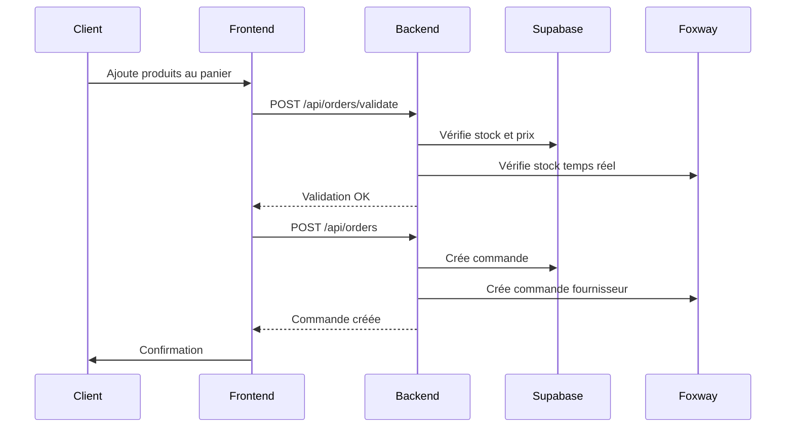

# Architecture des APIs - DBC B2B Platform

## Vue d'ensemble

Notre plateforme utilise plusieurs types d'APIs pour créer un écosystème complet de gestion B2B :

```
┌─────────────────┐    ┌─────────────────┐    ┌─────────────────┐
│   Frontend      │    │   Backend API   │    │   Base de       │
│   Next.js       │◄──►│   FastAPI       │◄──►│   données       │
│                 │    │                 │    │   Supabase      │
└─────────────────┘    └─────────────────┘    └─────────────────┘
                              │
                              ▼
                       ┌─────────────────┐
                       │   API Foxway    │
                       │   (Future)      │
                       └─────────────────┘
```

## 1. API Backend (FastAPI)

### Pourquoi FastAPI ?

- **Performance** : Très rapide, comparable à Node.js et Go
- **Type Safety** : Validation automatique avec Pydantic
- **Documentation** : Swagger UI automatique
- **Async** : Support natif de l'asynchrone
- **Python** : Réutilise nos scripts existants

### Structure des endpoints :

```python
# backend/api/main.py
from fastapi import FastAPI
from fastapi.middleware.cors import CORSMiddleware

app = FastAPI(title="DBC B2B API", version="1.0.0")

# Routes principales
@app.get("/api/health")           # Santé de l'API
@app.post("/api/auth/login")      # Authentification
@app.get("/api/catalog/products") # Catalogue produits
@app.post("/api/orders")          # Créer commande
@app.get("/api/orders/{id}")      # Détails commande
```

### Avantages :

- **Réutilisation** : Nos scripts Python deviennent des services
- **Validation** : Types automatiques (SKU, prix, quantités)
- **Sécurité** : JWT tokens, validation des permissions
- **Monitoring** : Logs structurés, métriques

## 2. Base de données Supabase

### Pourquoi Supabase ?

- **PostgreSQL** : Base robuste et performante
- **API REST automatique** : Endpoints générés automatiquement
- **Authentification** : Système complet intégré
- **Real-time** : Mises à jour en temps réel
- **Hosting** : Hébergement géré, pas de serveur à maintenir

### Architecture des données :

```sql
-- Tables principales
users (id, email, company, role, created_at)
products (sku, name, price_dbc, price_foxway, category, stock)
orders (id, user_id, status, total, created_at)
order_items (order_id, product_sku, quantity, unit_price)
catalogs (id, filename, upload_date, processed)
```

### Fonctionnalités Supabase utilisées :

#### 2.1 API REST automatique

```javascript
// Récupérer produits avec filtres
const { data } = await supabase
  .from("products")
  .select("*")
  .eq("category", "iPhone")
  .gte("stock", 1)
  .order("name");
```

#### 2.2 Authentification

```javascript
// Login utilisateur
const { user, error } = await supabase.auth.signInWithPassword({
  email: "client@entreprise.com",
  password: "motdepasse",
});
```

#### 2.3 Real-time (optionnel)

```javascript
// Écouter changements de stock
supabase
  .channel("stock-updates")
  .on(
    "postgres_changes",
    { event: "UPDATE", schema: "public", table: "products" },
    (payload) => updateProductStock(payload.new)
  )
  .subscribe();
```

### Avantages Supabase :

- **Développement rapide** : API prête en minutes
- **Sécurité** : Row Level Security (RLS)
- **Scalabilité** : Gère la montée en charge
- **Backup** : Sauvegardes automatiques
- **Dashboard** : Interface d'administration

## 3. API Frontend (Next.js)

### Architecture client :

```typescript
// src/lib/api.ts - Client API centralisé
class ApiClient {
  private baseURL = process.env.NEXT_PUBLIC_API_URL;

  async getProducts(filters?: ProductFilters) {
    return fetch(`${this.baseURL}/api/catalog/products`, {
      method: "GET",
      headers: { Authorization: `Bearer ${token}` },
    });
  }

  async createOrder(orderData: OrderRequest) {
    return fetch(`${this.baseURL}/api/orders`, {
      method: "POST",
      body: JSON.stringify(orderData),
    });
  }
}
```

### State Management avec Zustand :

```typescript
// src/lib/store.ts
interface AppState {
  user: User | null;
  cart: CartItem[];
  products: Product[];

  // Actions
  addToCart: (product: Product, quantity: number) => void;
  removeFromCart: (sku: string) => void;
  clearCart: () => void;
}

const useStore = create<AppState>((set) => ({
  // État initial et actions
}));
```

### React Query pour le cache :

```typescript
// src/hooks/useProducts.ts
export function useProducts(filters?: ProductFilters) {
  return useQuery({
    queryKey: ["products", filters],
    queryFn: () => apiClient.getProducts(filters),
    staleTime: 5 * 60 * 1000, // 5 minutes
    cacheTime: 10 * 60 * 1000, // 10 minutes
  });
}
```

## 4. Intégration API Foxway (Future)

### Objectifs :

- **Stock temps réel** : Vérification automatique
- **Prix actualisés** : Synchronisation quotidienne
- **Commandes automatiques** : Workflow complet

### Architecture prévue :

```python
# backend/integrations/foxway/client.py
class FoxwayClient:
    async def get_stock(self, sku: str) -> int:
        """Récupère stock temps réel"""

    async def get_pricing(self) -> List[Product]:
        """Récupère catalogue avec prix"""

    async def create_order(self, order: Order) -> str:
        """Crée commande chez Foxway"""
```

## 5. Workflow API complet

### Exemple : Commande client



## 6. Sécurité et Performance

### Authentification :

- **JWT tokens** : Stateless, sécurisé
- **Refresh tokens** : Session longue durée
- **Role-based access** : Permissions par rôle

### Performance :

- **Cache Redis** : Cache des catalogues
- **CDN** : Assets statiques
- **Pagination** : Listes de produits
- **Lazy loading** : Images produits

### Monitoring :

- **Logs structurés** : JSON avec contexte
- **Métriques** : Temps de réponse, erreurs
- **Alertes** : Stock bas, erreurs API

## 7. Déploiement

### Environnements :

- **Development** : Local avec Docker
- **Staging** : Vercel + Railway
- **Production** : Vercel + Railway + Supabase Pro

### CI/CD :

- **Tests** : Pytest + Jest
- **Déploiement** : GitHub Actions
- **Rollback** : Déploiement atomique

Cette architecture nous donne une base solide, évolutive et maintenable pour la plateforme B2B DBC.
