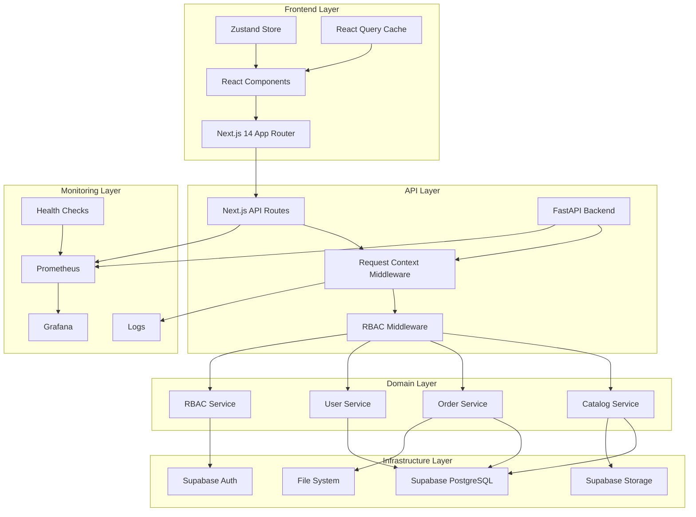
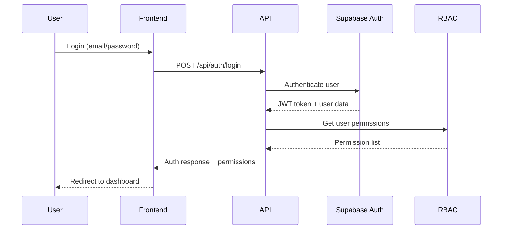
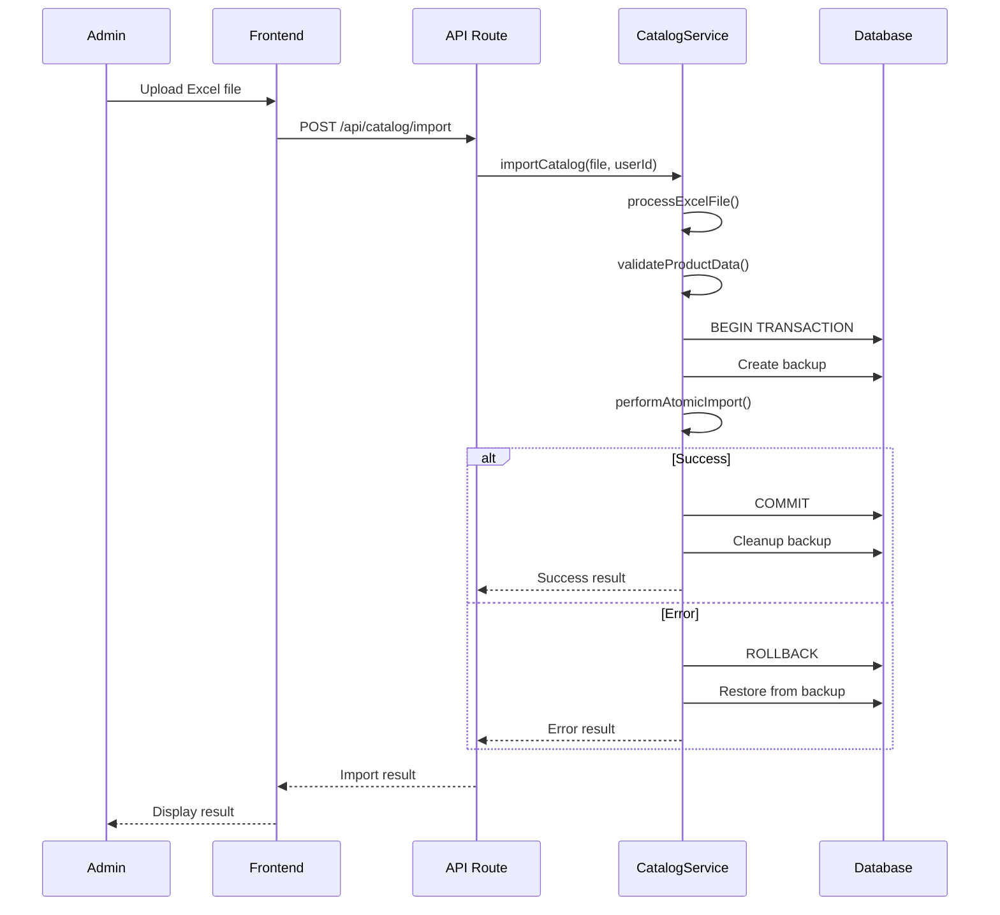
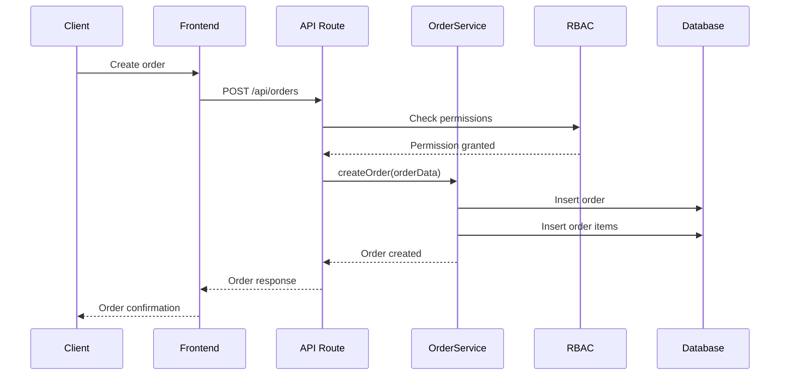
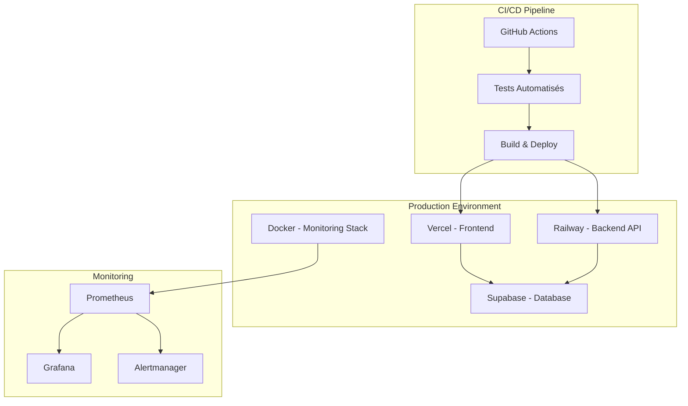

# 🏗️ Architecture DBC B2B Platform

## Vue d'ensemble

La plateforme DBC B2B est une application monolithique moderne construite avec Next.js 14 et FastAPI, conçue pour gérer les commandes B2B avec un système de catalogue extensible et des contrôles d'accès robustes (RBAC).

## Architecture Globale


```mermaid
graph TB
    subgraph "Frontend Layer"
        A[Next.js 14 App Router]
        B[React Components]
        C[Zustand Store]
        D[React Query Cache]
    end

    subgraph "API Layer"
        E[Next.js API Routes]
        F[FastAPI Backend]
        G[Request Context Middleware]
        H[RBAC Middleware]
    end

    subgraph "Domain Layer"
        I[Catalog Service]
        J[Order Service]
        K[User Service]
        L[RBAC Service]
    end

    subgraph "Infrastructure Layer"
        M[Supabase PostgreSQL]
        N[Supabase Auth]
        O[Supabase Storage]
        P[File System]
    end

    subgraph "Monitoring Layer"
        Q[Prometheus]
        R[Grafana]
        S[Health Checks]
        T[Logs]
    end

    A --> E
    B --> A
    C --> B
    D --> B
    E --> G
    F --> G
    G --> H
    H --> I
    H --> J
    H --> K
    H --> L
    I --> M
    J --> M
    K --> M
    L --> N
    I --> O
    J --> P

    E --> Q
    F --> Q
    S --> Q
    Q --> R
    G --> T
```

## Couches Architecturales

### 1. Frontend Layer (Next.js 14)

**Responsabilités:**

- Interface utilisateur responsive
- Gestion d'état côté client
- Authentification utilisateur
- Optimisation des performances

**Technologies:**

- Next.js 14 avec App Router
- TypeScript pour la sécurité des types
- Tailwind CSS pour le styling
- Zustand pour la gestion d'état
- React Query pour le cache et la synchronisation

**Structure:**

```
src/app/
├── (admin)/           # Routes protégées admin
├── (client)/          # Routes protégées client
├── (auth)/            # Pages d'authentification
├── api/               # API routes Next.js
└── globals.css        # Styles globaux
```

### 2. API Layer

**Responsabilités:**

- Routage des requêtes
- Validation des données
- Gestion des erreurs
- Logging et métriques

**Technologies:**

- Next.js API Routes (frontend)
- FastAPI (backend Python)
- Middleware personnalisés

**Fonctionnalités clés:**

- Request ID unique pour traçabilité
- Middleware RBAC pour les permissions
- Gestion centralisée des erreurs
- Métriques Prometheus

### 3. Domain Layer

**Responsabilités:**

- Logique métier
- Validation des règles business
- Orchestration des services

**Services principaux:**

#### CatalogService

- Import atomique des catalogues Excel
- Recherche et filtrage des produits
- Gestion des marges (11% normale, 1% marginale)
- Schéma flexible pour nouveaux attributs

#### OrderService

- Création et gestion des commandes
- Workflow de validation
- Export des données
- Gestion des IMEI/numéros de série

#### UserService

- Gestion des utilisateurs/clients
- Authentification et autorisation
- Profils d'entreprise

#### RBACService

- Système de permissions granulaires
- Vérification des droits d'accès
- Filtrage des données par utilisateur

### 4. Infrastructure Layer

**Responsabilités:**

- Persistance des données
- Authentification
- Stockage des fichiers
- Configuration

**Technologies:**

- Supabase PostgreSQL pour les données
- Supabase Auth pour l'authentification
- Supabase Storage pour les fichiers
- Variables d'environnement pour la configuration

### 5. Monitoring Layer

**Responsabilités:**

- Surveillance de la santé système
- Métriques business et techniques
- Alertes en cas de problème
- Tableau de bord opérationnel

**Technologies:**

- Prometheus pour la collecte de métriques
- Grafana pour la visualisation
- Health checks automatisés
- Logging structuré

## Flux de Données

### Flux d'Authentification


```mermaid
sequenceDiagram
    participant U as User
    participant F as Frontend
    participant A as API
    participant S as Supabase Auth
    participant R as RBAC

    U->>F: Login (email/password)
    F->>A: POST /api/auth/login
    A->>S: Authenticate user
    S-->>A: JWT token + user data
    A->>R: Get user permissions
    R-->>A: Permission list
    A-->>F: Auth response + permissions
    F-->>U: Redirect to dashboard
```

### Flux d'Import Catalogue


```mermaid
sequenceDiagram
    participant A as Admin
    participant F as Frontend
    participant API as API Route
    participant CS as CatalogService
    participant DB as Database

    A->>F: Upload Excel file
    F->>API: POST /api/catalog/import
    API->>CS: importCatalog(file, userId)
    CS->>CS: processExcelFile()
    CS->>CS: validateProductData()
    CS->>DB: BEGIN TRANSACTION
    CS->>DB: Create backup
    CS->>CS: performAtomicImport()
    alt Success
        CS->>DB: COMMIT
        CS->>DB: Cleanup backup
        CS-->>API: Success result
    else Error
        CS->>DB: ROLLBACK
        CS->>DB: Restore from backup
        CS-->>API: Error result
    end
    API-->>F: Import result
    F-->>A: Display result
```

### Flux de Commande


```mermaid
sequenceDiagram
    participant C as Client
    participant F as Frontend
    participant API as API Route
    participant OS as OrderService
    participant RBAC as RBAC
    participant DB as Database

    C->>F: Create order
    F->>API: POST /api/orders
    API->>RBAC: Check permissions
    RBAC-->>API: Permission granted
    API->>OS: createOrder(orderData)
    OS->>DB: Insert order
    OS->>DB: Insert order items
    OS-->>API: Order created
    API-->>F: Order response
    F-->>C: Order confirmation
```

## Système RBAC

### Matrice des Permissions

| Resource    | Admin Permissions                                | Client Permissions                       |
| ----------- | ------------------------------------------------ | ---------------------------------------- |
| **Catalog** | READ, WRITE, IMPORT                              | READ                                     |
| **Orders**  | READ_ALL, CREATE, UPDATE_ALL, DELETE_ALL, EXPORT | READ_OWN, CREATE, UPDATE_OWN, DELETE_OWN |
| **Users**   | READ_ALL, CREATE, UPDATE, DELETE                 | -                                        |
| **Metrics** | READ                                             | -                                        |
| **System**  | HEALTH, LOGS                                     | -                                        |

### Vérification des Permissions

```typescript
// Exemple d'utilisation
const user = getCurrentUser();

// Vérification simple
if (hasPermission(user, Permission.CATALOG_WRITE)) {
  // Permettre l'édition du catalogue
}

// Vérification avec ownership
await requirePermissionWithOwnership(
  "order",
  "read",
  checkOrderOwnership
)(user, orderId);

// Filtrage des données
const visibleOrders = filterByPermissions(user, allOrders, "order");
```

## Schéma de Base de Données

### Tables Principales

```sql
-- Utilisateurs et authentification
CREATE TABLE users (
  id UUID PRIMARY KEY DEFAULT gen_random_uuid(),
  email VARCHAR UNIQUE NOT NULL,
  role VARCHAR NOT NULL CHECK (role IN ('admin', 'client')),
  company_name VARCHAR,
  contact_name VARCHAR,
  phone VARCHAR,
  address TEXT,
  is_active BOOLEAN DEFAULT true,
  created_at TIMESTAMP DEFAULT NOW(),
  updated_at TIMESTAMP DEFAULT NOW()
);

-- Produits avec schéma flexible
CREATE TABLE products (
  sku VARCHAR PRIMARY KEY,
  product_name VARCHAR NOT NULL,
  price DECIMAL(10,2) NOT NULL,
  price_dbc DECIMAL(10,2) NOT NULL,
  supplier_price DECIMAL(10,2), -- Admin seulement
  quantity INTEGER DEFAULT 0,
  is_active BOOLEAN DEFAULT true,

  -- Attributs communs
  appearance VARCHAR,
  functionality VARCHAR,
  boxed VARCHAR,
  color VARCHAR,
  cloud_lock VARCHAR,
  additional_info TEXT,
  vat_type VARCHAR,
  campaign_price DECIMAL(10,2),
  item_group VARCHAR,

  -- Attributs dynamiques (JSON)
  dynamic_attributes JSONB,

  created_at TIMESTAMP DEFAULT NOW(),
  updated_at TIMESTAMP DEFAULT NOW()
);

-- Commandes
CREATE TABLE orders (
  id UUID PRIMARY KEY DEFAULT gen_random_uuid(),
  name VARCHAR NOT NULL,
  status VARCHAR NOT NULL DEFAULT 'draft',
  status_label VARCHAR NOT NULL DEFAULT 'Brouillon',
  customer_ref VARCHAR,
  user_id UUID REFERENCES users(id),
  total_amount DECIMAL(10,2) DEFAULT 0,
  total_items INTEGER DEFAULT 0,
  vat_type VARCHAR,
  created_at TIMESTAMP DEFAULT NOW(),
  updated_at TIMESTAMP DEFAULT NOW()
);

-- Articles de commande
CREATE TABLE order_items (
  id UUID PRIMARY KEY DEFAULT gen_random_uuid(),
  order_id UUID REFERENCES orders(id) ON DELETE CASCADE,
  sku VARCHAR REFERENCES products(sku),
  product_name VARCHAR NOT NULL,
  quantity INTEGER NOT NULL,
  unit_price DECIMAL(10,2) NOT NULL,
  total_price DECIMAL(10,2) NOT NULL,
  created_at TIMESTAMP DEFAULT NOW()
);

-- IMEI/Numéros de série
CREATE TABLE order_item_imei (
  id UUID PRIMARY KEY DEFAULT gen_random_uuid(),
  order_item_id UUID REFERENCES order_items(id) ON DELETE CASCADE,
  sku VARCHAR NOT NULL,
  imei VARCHAR NOT NULL,
  product_name VARCHAR NOT NULL,
  appearance VARCHAR,
  functionality VARCHAR,
  boxed VARCHAR,
  color VARCHAR,
  cloud_lock VARCHAR,
  additional_info TEXT,
  supplier_price DECIMAL(10,2),
  dbc_price DECIMAL(10,2),
  created_at TIMESTAMP DEFAULT NOW()
);
```

### Index pour Performance

```sql
-- Index pour les recherches fréquentes
CREATE INDEX idx_products_active ON products(is_active);
CREATE INDEX idx_products_search ON products USING gin(to_tsvector('french', product_name));
CREATE INDEX idx_products_price_range ON products(price_dbc);
CREATE INDEX idx_orders_user_status ON orders(user_id, status);
CREATE INDEX idx_orders_created_at ON orders(created_at DESC);
CREATE INDEX idx_dynamic_attributes ON products USING gin(dynamic_attributes);
```

## Configuration des Environnements

### Variables d'Environnement

```bash
# Supabase Configuration
NEXT_PUBLIC_SUPABASE_URL=https://xxx.supabase.co
NEXT_PUBLIC_SUPABASE_ANON_KEY=your_anon_key_here
SUPABASE_SERVICE_ROLE_KEY=your_service_role_key_here

# API Configuration
NEXT_PUBLIC_API_URL=https://api.dbc-b2b.com

# Monitoring
GRAFANA_USER=admin
GRAFANA_PASSWORD=your_secure_password
GRAFANA_DOMAIN=monitoring.dbc-b2b.com

# External APIs (Future)
FOXWAY_API_URL=https://api.foxway.com/v1
FOXWAY_API_KEY=your_api_key

# CORS
CORS_ORIGINS=https://app.dbc-b2b.com,https://admin.dbc-b2b.com
```

### Configuration par Environnement

| Environment     | Frontend URL                | Backend URL                     | Database       | Monitoring         |
| --------------- | --------------------------- | ------------------------------- | -------------- | ------------------ |
| **Development** | http://localhost:3000       | http://localhost:8000           | Local Supabase | Local stack        |
| **Staging**     | https://staging.dbc-b2b.com | https://api-staging.dbc-b2b.com | Staging DB     | Staging monitoring |
| **Production**  | https://app.dbc-b2b.com     | https://api.dbc-b2b.com         | Production DB  | Full monitoring    |

## Sécurité

### Authentification et Autorisation

1. **JWT Tokens** via Supabase Auth
2. **Row Level Security** (RLS) sur PostgreSQL
3. **Middleware RBAC** pour les permissions granulaires
4. **Request ID** pour la traçabilité
5. **Rate limiting** sur les endpoints sensibles

### Protection des Données

1. **Chiffrement** en transit (HTTPS) et au repos
2. **Variables d'environnement** pour les secrets
3. **Validation** des entrées utilisateur
4. **Sanitization** des données
5. **Audit logs** pour les actions critiques

### Conformité

1. **RGPD** - Gestion des données personnelles
2. **Logs structurés** pour l'audit
3. **Sauvegarde** et récupération des données
4. **Tests de sécurité** automatisés

## Performance et Scalabilité

### Optimisations Frontend

1. **Static Generation** pour les pages publiques
2. **Incremental Static Regeneration** pour le catalogue
3. **Image optimization** avec Next.js
4. **Code splitting** automatique
5. **Service Worker** pour la mise en cache

### Optimisations Backend

1. **Connection pooling** PostgreSQL
2. **Index** sur les requêtes fréquentes
3. **Pagination** pour les grandes listes
4. **Cache** Redis (futur)
5. **CDN** pour les assets statiques

### Monitoring des Performances

1. **Métriques Prometheus** pour le monitoring
2. **Health checks** automatisés
3. **Alertes** en cas de dégradation
4. **Profiling** des requêtes lentes
5. **Tableau de bord** Grafana temps réel

## Déploiement

### Infrastructure


```mermaid
graph TB
    subgraph "Production Environment"
        A[Vercel - Frontend]
        B[Railway - Backend API]
        C[Supabase - Database]
        D[Docker - Monitoring Stack]
    end

    subgraph "CI/CD Pipeline"
        E[GitHub Actions]
        F[Tests Automatisés]
        G[Build & Deploy]
    end

    subgraph "Monitoring"
        H[Prometheus]
        I[Grafana]
        J[Alertmanager]
    end

    E --> F
    F --> G
    G --> A
    G --> B
    A --> C
    B --> C
    D --> H
    H --> I
    H --> J
```

### Pipeline de Déploiement

1. **Commit** sur la branche principale
2. **Tests automatisés** (Jest + Pytest)
3. **Build** et validation
4. **Déploiement** automatique
5. **Health checks** post-déploiement
6. **Notification** des équipes

### Rollback Strategy

1. **Versioning** des déploiements
2. **Blue-Green deployment** pour zero-downtime
3. **Database migrations** réversibles
4. **Rollback automatique** en cas d'échec
5. **Monitoring** continu post-déploiement

## Maintenance et Evolution

### Processus de Développement

1. **Feature flags** pour les nouvelles fonctionnalités
2. **Tests A/B** pour les améliorations UX
3. **Code review** obligatoire
4. **Documentation** automatique
5. **Monitoring** des erreurs en production

### Roadmap Technique

1. **Q1 2024**: Intégration API Foxway
2. **Q2 2024**: Cache Redis et optimisations
3. **Q3 2024**: Module de facturation automatisée
4. **Q4 2024**: Analytics avancées et BI

Cette architecture garantit la robustesse, la sécurité et la scalabilité de la plateforme DBC B2B tout en maintenant une complexité maîtrisée et une maintenabilité élevée.
